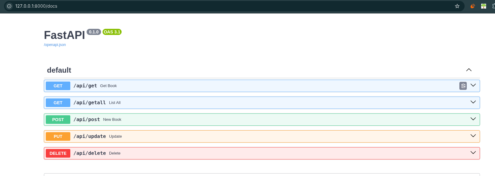
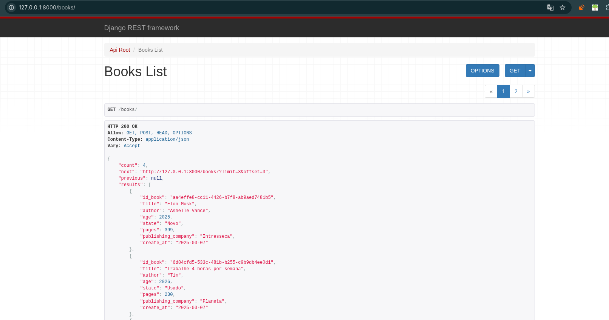
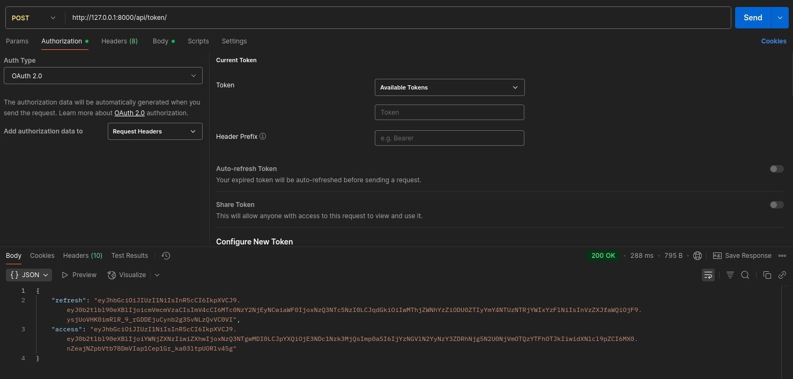

# Pequenos projetos sobre API's

## Linguagem Python 🐍
- Cada pasta (` jwt, livros, livros_DRF `) contêm um arquivo explicando sobre como funciona o fluxo dos programas.

## Resumo
- `livros`:
    - API simples sobre livros utilizando a biblioteca `Fast api` para construção da API
    - Usando banco de dados `MySQL`.
    
- `livros_DRF`:
    - API usando o `Django Rest Framework` (DRF) para também criar uma API sobre livros de formas mais robusta
    - Usando banco dados relacional `SQLite3` (padrão).

    
- `jwt`:
    - Uso do `Jason Web Token` (JTW) para autenticação, com sistema simples de permissões para usuários.
    - Usando banco dados relacional `SQLite3` (padrão).

    
