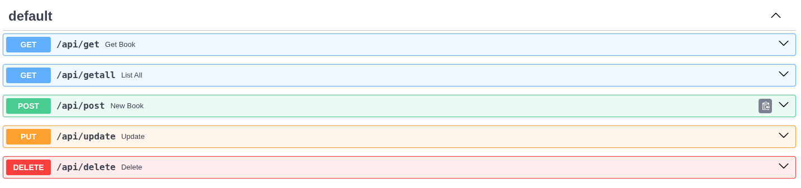
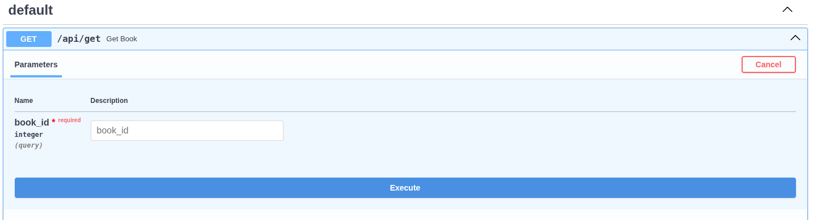
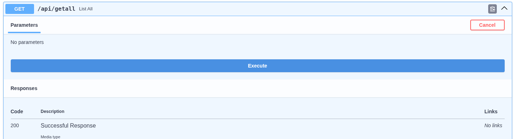
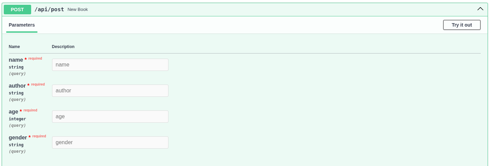
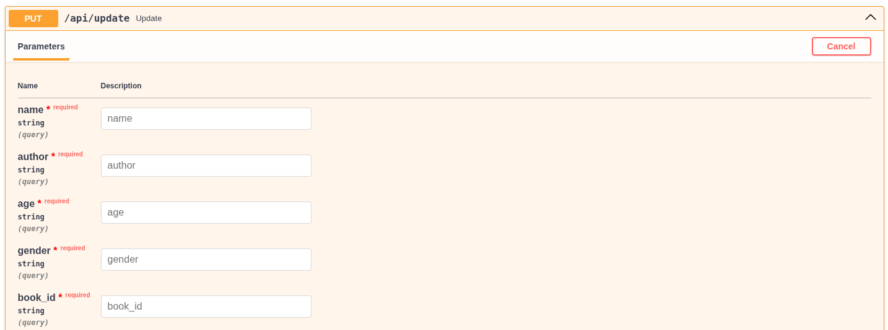
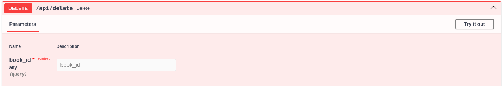

# Api para livros (simples)
### Tecnologia usada:
- fast api
- Python


### banco de dados
- Campos:
    - id
    - name
    - author
    - age
    - gender

-  Banco de dados :
```SQL
    CREATE DATABASE IF NOT EXISTS {self.databaseName}  -- Adicionar IF NOT EXISTS é uma boa prática aqui também
    CHARACTER SET utf8mb4
    COLLATE utf8mb4_unicode_ci;

    USE {self.databaseName};
CREATE TABLE IF NOT EXISTS {self.tableName}( id INT AUTO_INCREMENT PRIMARY KEY, name VARCHAR(400),
    author VARCHAR(400),
    age INT,
    gender VARCHAR(100)
```

## Métodos do arquivo *database.py*

- `create_table()`
- Cria o banco de dados com nome da database pré definidos:

    - Nome da database: ` library`
    - Tabela: `booksdb`

### `class DataBase():`
- Escolha sua senha e nome de usuário para seu banco de dados. Para estas configurações use as veriáveis
de ambiente use um arquivo *`.env`*.
    - Argumentos da Class:
        - host: str
        - database: str
        - user: str
        - password: str

### `add_new_book()`:
- Adiciona um novo livro ao banco de dados
    - Parâmetros (id é criado automaticamente):
        - name: str
        - author: str
        - age: int
        - gender: str

### `list_all`
- Lista todos os livros presentes no bando de dados
     - Parâmetro:
        - Sem parâmetro

### `get_book()`
- Pega as informações de um livro em específico.
    - Parâmetro:
         - book_id: int

### `update_info`
- Atualiza as informações sobre um livro específico
    - Parâmetro:
         - book_id: int

### ` remove_book`
- Deleta um livro da base de dados
    - Parâmetro:
         - book_id: int

### `end_connect()`
- Encerra a conexão com o banco de forma segura
     - Parâmetro:
        - Sem parâmetro
### Swagger (http://127.0.0.1:8000/docs/):



## Arquivo *main.py*
- Cada função criada executa uma função definida no banco de dados, seu diferencial
está contido em algumas validações básicas (url: http://127.0.0.1:8000/api/).


- Função  `get_book()` | Método GET | `/api/get`
         - Parâmetro:
            - book_id: int
        - Retorno:
            - Dicionário Python




- Função `list_all()` | Método GET | `/api/getall`
    - Retorna todos os livros cadastrados
         - Parâmetro:
            - Sem parâmetro
        - Retorno:
            - Dicionário Python


- Função `new_book` | Método POST | `/api/post`
    - Parâmetros (id é criado automaticamente):
        - name: str
        - author: str
        - age: int
        - gender: str
    - Retorno:
        - Dicionário Python


- Função `update()` | Método PUT/PATH | `api/update`
    - Parâmetros (Id é criado automaticamente):
        - name: str
        - author: str
        - age: int
        - gender: str
        - book_id (Id do Livro que se quer atualizar)
    - Retorno:
        - Dicionário Python


- Função `delete()` | Método PUT/DELETE | `api/delete`
    - Parâmetro:
        - book_id (Id do livro que se quer deletar)
    - Retorno:
        - Dicionário Python

